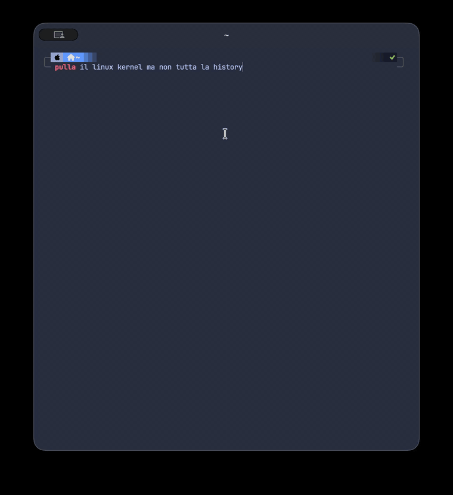

# lmcomplete / `lmc`

[](https://github.com/MatteoSava/lmcomplete/actions/workflows/ci.yml)
[](https://github.com/MatteoSava/lmcomplete/actions/workflows/cd.yml)

`lmcomplete` is a context-aware shell command helper for turning natural-language requests into shell commands and short explanations. The `lmc` binary uses your shell, current directory, git state, and recent command history to produce tighter results than a plain prompt.

It is intentionally small and opinionated in v1:

- `lmc "..."` is shorthand for `lmc expand "..."`
- `expand` returns a shell command only
- `explain` returns a concise plain-text explanation
- `audit` prints the prompt bundle without calling the provider
- `init zsh` prints the zsh widget script
- `stats` shows stored usage stats

## Supported Scope

Launch support is intentionally narrow:

- macOS-first
- zsh-first
- OpenRouter-only
- no auto-execution

`lmc` prints commands. It does not run them for you.

## Demo

Quick terminal demo:

<picture>
  <source srcset="./docs/demo/demo.gif" type="image/gif">
  
</picture>

Full `lmc` workflow demo:

<picture>
  <source srcset="./docs/demo/lmc-demo.gif" type="image/gif">
  
</picture>

## Install

From crates.io after release:

```sh
cargo install lmcomplete
```

From a local checkout:

```sh
cargo install --path .
```

Build from source during development:

```sh
cargo build
```

## Quickstart

1. Set your OpenRouter API key:

```sh
export OPENROUTER_API_KEY="your-key-here"
```

2. Build or install `lmc`.

3. Add the zsh widget to your shell startup:

```sh
eval "$(lmc init zsh)"
```

4. Ask for a command:

```sh
lmc "show git status"
```

5. Use the explicit commands when you want to be precise:

```sh
lmc expand "commit all changes with message fix login" --shell zsh --history 0
lmc explain "tar xzf archive.tar.gz" --shell zsh --history 0
```

## Config And Auth

`lmc` reads an optional TOML config file from the XDG config location. By default that is:

- `~/.config/lmcomplete/config.toml`

If `XDG_CONFIG_HOME` is set, `lmc` uses `$XDG_CONFIG_HOME/lmcomplete/config.toml` instead.

You can also point at a specific file:

```sh
lmc --config /path/to/config.toml stats
```

The canonical documented example lives in [`docs/config.example.toml`](docs/config.example.toml).

Set the API key in the environment or in config:

```sh
export OPENROUTER_API_KEY="your-key-here"
```

If you store the key in the config file, keep it private. On Unix, `lmc` expects the file mode to be `0600`.

## Examples

Return a command:

```sh
lmc expand "show git status" --shell zsh --history 0
```

Explain a command:

```sh
lmc explain "tar xzf archive.tar.gz" --shell zsh --history 0
```

Inspect the prompt bundle without calling the provider:

```sh
lmc audit 'curl -H "Authorization: Bearer sk-secret-value" https://example.com' --shell zsh --history 0
```

Show current usage stats:

```sh
lmc stats
```

Initialize the zsh widget:

```sh
lmc init zsh
```

## Safety And Privacy

`lmc` sends the minimum context needed for a better completion: shell, operating system, cwd-derived project info, git state, and recent shell history when available.

Secret-like values are redacted before prompts are sent. The `audit` command lets you inspect the final prompt bundle locally without making a provider request.

The tool also keeps a hard line on execution: it suggests commands, it does not run them.

## Troubleshooting

If you see `missing provider API key`, export `OPENROUTER_API_KEY` or add `api_key` under `[provider]` in your config file.

If you see `config file ... must have mode 0600`, tighten the file permissions on Unix:

```sh
chmod 600 ~/.config/lmcomplete/config.toml
```

If `init zsh` does nothing after you run it, add `eval "$(lmc init zsh)"` to `~/.zshrc`, then restart zsh or source the file.

If `expand` or `explain` returns an error about the provider, check network access, the OpenRouter API key, and the model configuration in your config file.

## CI/CD

CI runs on pushes, pull requests, and manual dispatch. It checks version metadata, formatting, clippy, tests, and a `cargo publish --dry-run`.

CD runs when a `vX.Y.Z` tag is pushed. It verifies the tag matches `Cargo.toml` and `CHANGELOG.md`, repeats the CI checks, publishes to crates.io with `CARGO_REGISTRY_TOKEN`, and creates a GitHub release.

## Changelog

See [CHANGELOG.md](./CHANGELOG.md) for release notes.
See [docs/launch/terminal-demo-plan.md](./docs/launch/terminal-demo-plan.md) for the launch demo script.
