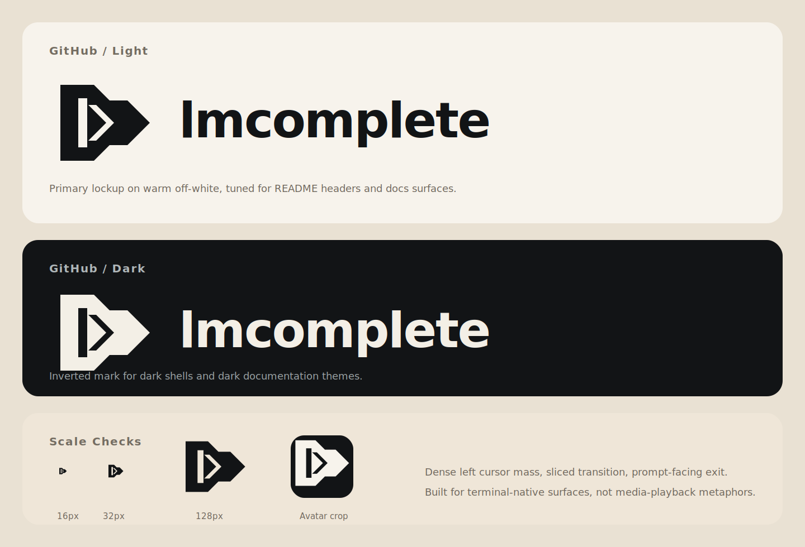

# `lmcomplete` Brand Assets

This package contains the first-pass logo system for `lmcomplete`, the public product name for `lmc`: a terminal-native mark where a block cursor resolves into a command prompt shape.

The SVG and PNG filenames are legacy working names that will remain in place for launch to avoid churn. Public copy should use `lmcomplete` for the product and `lmc` for the binary.

## Files

- `streaming-wait-logo.svg`: primary combination mark for docs, headers, and wide layouts.
- `streaming-wait-icon.svg`: standalone symbol for favicons, avatars, and compact UI placements.
- `streaming-wait-wordmark.svg`: text-only lockup for cases where the icon is already established nearby.
- `streaming-wait-specimen.svg`: light/dark specimen board showing the intended GitHub-style presentation.
- `png/streaming-wait-icon-*.png`: raster exports for icon-sized usage.

## Usage

- Use the combination mark for README headers, docs pages, and other horizontal placements.
- Use the icon-only asset for `16px` to `32px` surfaces, including terminal-adjacent UI, avatars, and favicons.
- Use the wordmark-only asset only when the icon appears elsewhere on the same screen or layout.
- Keep clear space equal to the width of the icon's internal cursor slit.
- Avoid gradients, outlines, shadows, or recoloring the core mark beyond solid dark-on-light or light-on-dark use.

## Minimum Sizes

- Combination mark: `180px` wide minimum.
- Wordmark-only: `140px` wide minimum.
- Icon-only: `16px` minimum, with `32px+` preferred for UI surfaces.

## Launch Naming

- Product name: `lmcomplete`
- Binary name: `lmc`
- Legacy asset filenames: `streaming-wait-*`
- Preferred public wording for launch assets: `lmcomplete` in prose, `lmc` in binary references
